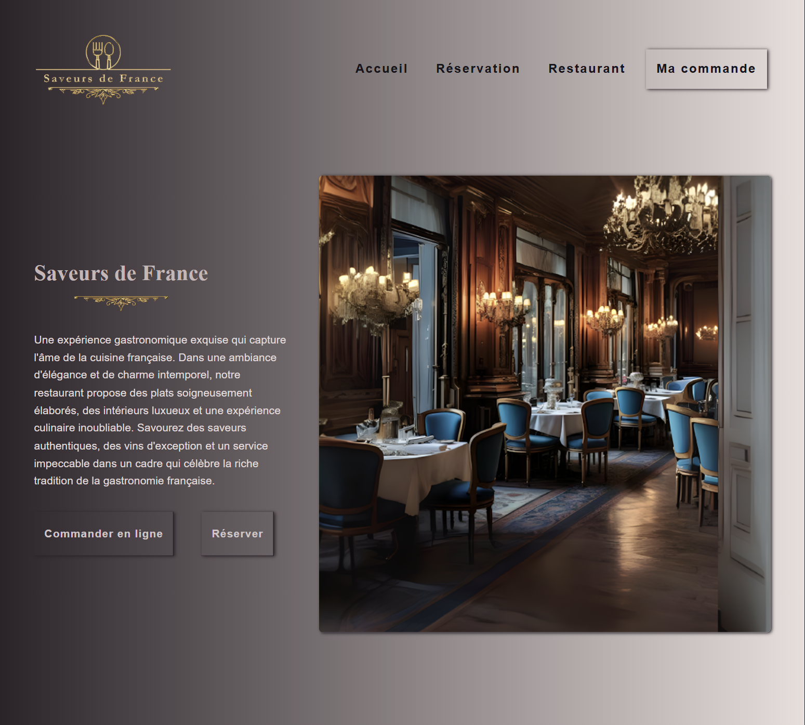
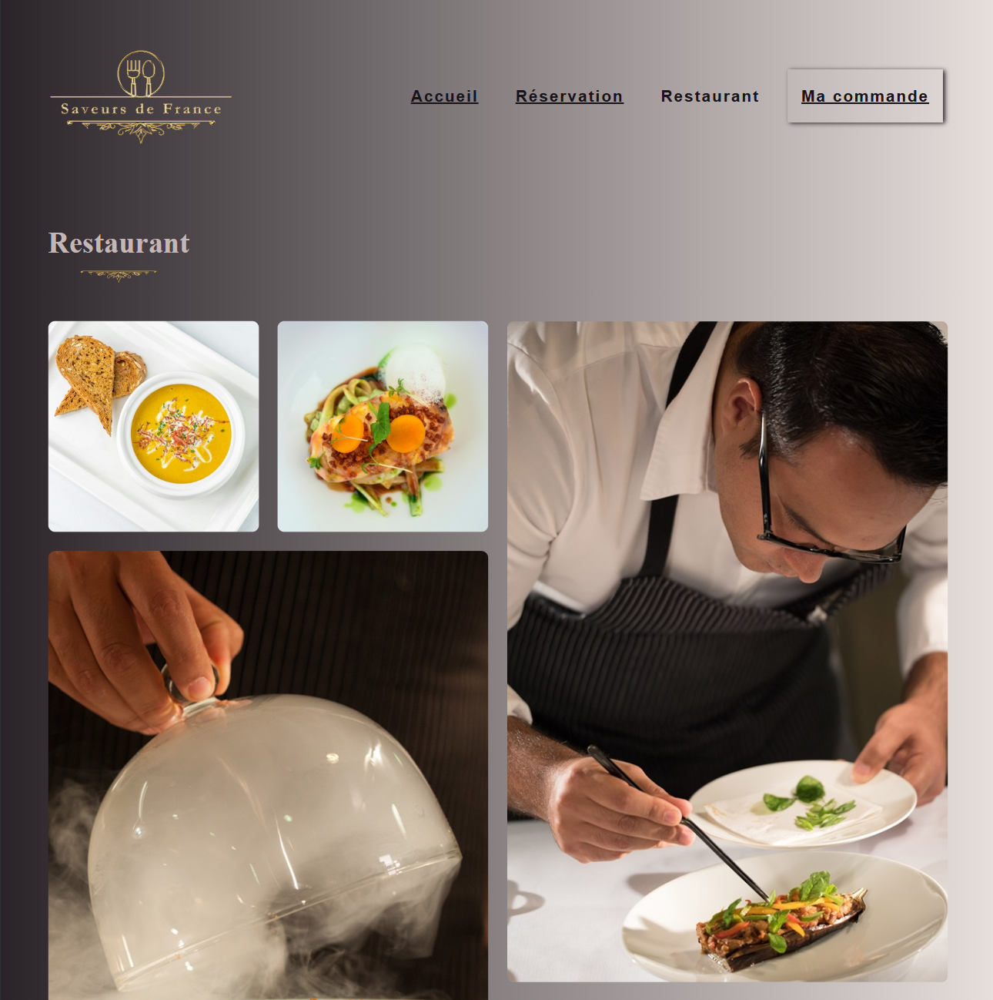
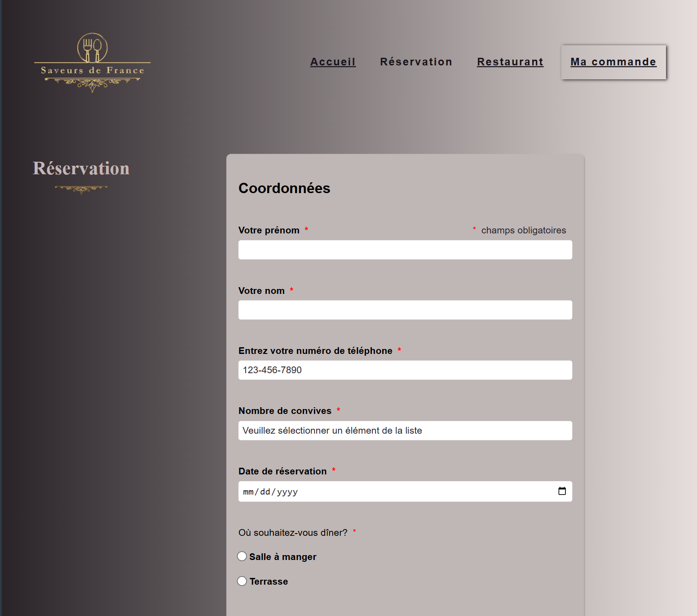
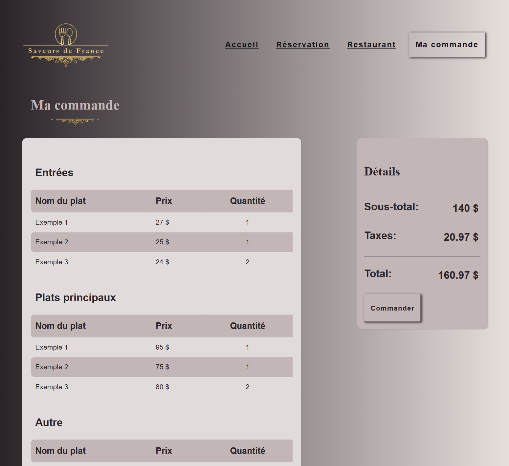
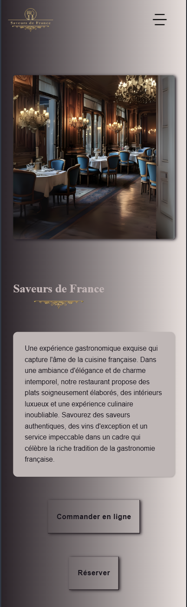

# Saveurs de France – Restaurant Website
Responsive multi-page restaurant website built with HTML5 and CSS3.

## Live Demo
https://saveurs-de-france.netlify.app

## Overview

This project is a front-end website for a restaurant, designed to present information, allow users to explore the menu, and simulate a reservation experience.

The focus was on building a clean layout, structuring content properly, and ensuring a responsive design across different screen sizes.

## Technologies

- HTML5
- CSS3
- Flexbox
- CSS Grid

## Features

- Responsive layout using media queries
- Multi-page navigation (Accueil, Réservation, Restaurant, Commande)
- Reservation form (UI only)
- Image gallery using CSS Grid
- Layout built with Flexbox and CSS Grid
- Semantic HTML structure

## Pages

- **Home** – Presentation and main content
- **Reservation** – Form to book a table
- **Restaurant** – Image gallery and information
- **Order** – Menu and order overview (UI)

## Notes

This project focuses on front-end structure and design.  
Some interactive features (like the mobile menu or form submission) are not functional, as they require JavaScript.

## Preview

Homepage

Restaurant

Reservation

Commande

Mobile View

## Author

Hannela Raudik  
GitHub: https://github.com/otsingx
